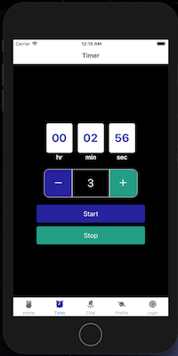

# Meditation Timer ⏳ React Native Application

> A user logs in through google oAuth where a personal and configurable profile loads with views related to the meditation session timer, session tracking calendar, profile. ⏲

```haskell
react-native
react-navigation
expo
Google oAuth2

({Secondary Packages})
react-native-numeric-input

```

---

## Resources

[Trello Board](https://trello.com/b/mEUYefim/med-timer-native-app)

Google Auth object:

```js
  user: {
    email: string,
    id: string,
    givenName: string,
    familyName: string,
    photo: string, // url
    name: string // full name
  }
```

---


